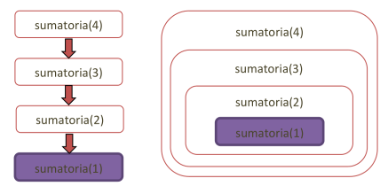

# Recursión

Created: August 22, 2024 10:34 PM
Ejercicios: https://github.com/solcrespi05/Algo_2_ejercicios/tree/main/Recursion

# Introducción

El concepto de recursión permite modelar soluciones elegantes a problemas particulares. Su aplicación en diversas técnicas de resolución de problemas ofrecen las bases para implementar estructuras complejas de gran utilidad. Se utiliza para descomponer problemas complejos en subproblemas más pequeños y manejables. 

### Diseño de una operación recursiva

podemos definir una estructura de operación general para resolver un problema recursivo: 

```python
funcion resolver(problema)
    si problema es simple entonces
        devolver solucion
    sino
        dividir problema en subproblema1..N
        resolver(subproblema1)
        resolver(subproblema2)
        ..
        resolver(subproblemaN)
        combinar_soluciones
        devolver solución
    finSi
finFuncion
```

Siempre debemos contemplar incorporar el o los casos bases para poder darle corte a las invocaciones recursivas, por eso se muestra aquí con un `if` bien explícito (aunque no siempre será necesariamente así). Luego en el caso recursivo (la sección del `else`), realizamos primero las divisiones necesarias en subproblemas y los utilizamos para resolver parcialmente el problema con invocaciones recursivas. Finalmente se combinan esas soluciones parciales para devolver el resultado de esa instancia del problema.

### Orden de las instancias

Cuando trabajamos con estructuras recursivas, podemos apoyarnos en este orden que surge entre sus elementos para aplicar operaciones recursivas ya que siempre tendremos **uno o más elementos mínimos** para tomar como casos base.

Caso Base: Es la condición que termina las llamadas recursivas. Sin un caso base, la recursión continuaría indefinidamente, causando un desbordamiento de la pila (stack overflow).

Estas estructuras deben relacionarse mediante un orden bien fundado, cualquier conjunto de elementos ordenados debe tener un elemento mínimo. Así garantizamos que toda instancia o elemento se descompone necesariamente en subinstancias o subelementos menores. 

Para evitar problemas de recursión infinita hay que tener en consideración la entrada. Por eso es clave siempre **identificar los elementos mínimos** que marcan los casos base y que se **invoque a instancias más reducidas** en cada recursión.

```python
def sumatoria(n: int) -> int:
    if n < 1:
        raise ValueError(f'Se recibe {n}, n debe ser mayor a 0')
    elif n == 1:
        return 1
    else:
        return sumatoria(n-1) + n

sumatoria(10)   # 55
sumatoria(-2)   # ValueError: Se recibe -2, n debe ser mayor a 0
```

El orden sería algo así: 



## Tipos de recursión

### Clasificación según referencias

Se basa en la cantidad de referencias recursivas que existen de un elemento a sí mismo, sean llamadas a bloque de código o composiciones de subestructuras de mismo tipo.

- Recursión simple: existe una única llamada en una función o procedimiento. También llamda recursión lineal.
- Recursión múltiple: cuando las referencias a sí mismo superan la unidad. Podemos identificar casos particulares como **recursión doble** o **recursión triple** si son dos o tres referencias recursivas respectivamente. Es ineficiente ya que se genera un árbol de invocaciones.
    
    Un estilo de diseño de algoritmos donde se divide un problema en subproblemas similares que se combinan en una solución recursiva y utilizando la técnica de *memoization*, se lo denomina **programación dinámica**. 
    
    > En Python es una buena práctica utilizar tipos inmutables cuando necesitamos definir valores por defecto en parámetros de operaciones.
    > 

```python
#Recursión simple
def factorial(n: int) -> int:
    if n <= 1:
        return 1
    else:
        return factorial(n-1) * n
        
 #Recursión multiple
 def fibonacci(n: int) -> int:
    if n <= 1:
        return n
    else:
        return fibonacci(n-1) + fibonacci(n-2)
```

### Clasificación según dirección

Se basa en determinar si la recursión ocurre o no en la misma operación. Esto también se aplica para el caso de estructuras recursivas.

- Recursión directa: una operación recursiva que realiza su invocación a sí misma dentro de su propio cuerpo.
- Recursión indirecta: puede suceder que una operación vuelva a ser invocada a así misma a partir de invocaciones intermediarias a otras operaciones dentro de la instancia recursiva.
    
    `operacion1 -> operacion2 -> operacion3 -> operacion1`
    
    - Recursión mutua: caso especial cuando solo intervienen dos componentes.
    
    ```python
    def es_par(n: int) -> bool:
      return n == 0 or es_impar(n - 1)
    
    def es_impar(n: int) -> bool:
      return False if n == 0 else es_par(n - 1)
    
    print(es_par(10))   # True
    print(es_par(9))    # False
    print(es_impar(4))  # False
    print(es_impar(7))  # True
    ```
    

### Clasificación según visibilidad

- Recursión explícita: la ejecución siempre se realiza sobre una función o procedimiento recursivo. se tiene visibilidad que se está ejecutando un bloque recursivo.
- Recursión implícita: la invocación inicial se realiza mediante un procedimiento o función que no presenta recursión, el cual invoca a otro procedimiento o función que sí presenta recursión.
    
    ```python
    def mostrar_paridad(n: int) -> None:
        if es_par(n):
            print(f'{n} es par')
        else:
            print(f'{n} es impar')
    ```
    

# Tipos Recursivos

Pensaremos soluciones a partir del diseño de nuevos **tipos abstractos de datos (TAD) que se construirán a partir de sí mismos**, derivando en **tipos de datos recursivos**.

Los tipos lineales son aquellos que se componen con una única referencia a sí mismos. El tipo recursivo siempre tendrá al menos un elemento de construcción no recursivo y al menos un elemento que sí lo será.

Los tipos recursivos **necesitan implementarse con punteros**, ya que su naturaleza recursiva implica una **estructura infinita creciente** y es imposible de implementar de forma estática (necesitaríamos memoria infinita para hacerlo).

## TAD Nat

### Estructura interna

```python
from typing import Union, TypeAlias

Nat: TypeAlias = Union["Cero", "Suc"]

class Cero:
    def __repr__(self):
        return 'Cero'

class Suc:
    def __init__(self, pred: Nat):
        self.pred = pred

    def __repr__(self):
        if isinstance(self.pred, Cero):
            return 'Suc(Cero)'
        else:
            return f'Suc({self.pred.__repr__()})'
```

En primer lugar establecemos que un objeto de tipo `Nat` puede ser una de las dos abstracciones que mencionamos mediante el uso del tipo `Union` que nos ofrece esta posibilidad. Entonces un objeto de tipo `Nat` puede ser una instancia de tipo `Cero` o `Suc`. Luego definimos ambas clases para modelar estas abstracciones.

La clase `Suc` representa la idea del *Sucesor* y permite construir representaciones del resto de los números naturales. Su estructura requiere sólo saber cuál es el predecesor que también será de tipo `Nat`, aquí se ve la **recursión indirecta simple de la estructura**. Es indirecta porque `Nat` puede ser de tipo `Suc` y este último se compone de un `Nat`, precisamente una **recursión mutua**.

### Operaciones básicas

**Constructoras**

Antes que nada debemos implementar operaciones para generar elementos de este tipo `Nat`. Como hemos visto, necesitamos construir dos tipos de abstracciones: el cero y cualquier otro número. Por lo tanto continuamos con esa idea.

```python
def cero() -> Nat:
    return Cero()

def suc(n: Nat) -> Nat:
    return Suc(n)
```

**Proyectoras**

Veamos ahora algunas operaciones básicas que proyecten la estructura interna (estado) del tipo `Nat`.

```python
def es_cero(n: Nat) -> bool:
    return isinstance(n, Cero)

def pred(n: Nat) -> Nat:
    if es_cero(n):
        raise ValueError('cero no tiene predecesor')
    else:
        return n.pred
```

### Operaciones adicionales

?

## Lista dinámica

Es la clásica lista dinámica simplemente enlazada. Se trata de una secuencia de nodos que se conectan en una única dirección y tiene la ventaja sobre los arreglos estáticos que puede incrementarse de forma indefinida.


 Al **dato del primer nodo** de la lista lo consumiremos con la operación `head()`, mientras que **la sublista que no incluye el primer nodo** la obtendremos con la operación `tail()`.

### Estructura interna

Tenemos dos abstracciones a modelar para construir todos los elementos posibles de `Lista`: la lista vacía y agregar un elemento a una lista( es la construcción de una lista a partir de otra lista incorporando un nodo nuevo al inicio). 

```python
from typing import Generic, TypeVar, Optional, TypeAlias

T = TypeVar('T')
ListaGenerica: TypeAlias = "Lista[T]"

class Nodo(Generic[T]):
    def __init__(self, dato: T, sig: Optional[ListaGenerica] = None):
        self.dato = dato
        if sig is None:
            self.sig= Lista()
        else:
            self.sig = sig

class Lista(Generic[T]):
    def __init__(self):
        self._head: Optional[Nodo[T]] = None
       
```

### Operaciones básicas

**Constructoras**

La construcción de elementos de este tipo se apoya nuevamente en dos abstracciones: construir una lista vacía y construir una lista a partir de otra con un elemento agregado al inicio.

La primera ya la tenemos implementada a través del inicializador de la clase `__init__()`. La segunda la implementaremos como una **operación modificadora** para asemejarla a cómo se hace con las listas nativas de Python.

```python
from copy import copy

def insertar(self, dato: T):
    actual = copy(self)
    self._head = Nodo(dato, actual)
```

**Proyectoras**

Existen tres operaciones importantes para analizar el estado de una lista.

```python
def es_vacia(self) -> bool:
    return self._head is None

def head(self) -> T:
    if self.es_vacia():
        raise IndexError('lista vacia')
    else:
        return self._head.dato
    
def tail(self) -> ListaGenerica:
    if self.es_vacia():
        raise IndexError('lista vacia')
    else:
        return copy(self._head.sig)
```

El método `es_vacia()` retorna simplemente si la lista es vacía o no. El método `head()` devuelve el valor del dato almacenado en el primer nodo de la lista. El método `tail()` nos entrega la sublista sin el primer nodo.

# Formas de recursión en operaciones

## Recursión de pila

Las operaciones que aún tienen sentencias de ejecución estarán en bloques inferiores de la pila. A este diseño lo llamamos recursión de pila, ya que para resolver el problema recursivo nos apoyamos en la **pila de ejecución.**

Tiene la ventaja de permitir soluciones recursivas mas elegantes y es la forma mas natural de estas mismas. Una de las desventajas es que puede provocar una saturación de la pila cuando la recursión es muy profunda, ya que la pila de ejecución es finita. 

> La recursión de pila sucede cuando en el caso recursivo **nos quedan operaciones pendientes por hacer luego de la invocación recursiva**.
> 

Ejemplo del caso factorial:


Cuando se llega al caso base no existen otras invocaciones recursivas sino que **comienza la *vuelta hacia atrás*** de la recursión.

## Recursión de cola

Cuando estemos ante una **recursión simple**, es posible encontrar una forma de resolución que **no requiera apoyarse en la pila de ejecución**. En este caso se construye a medida que se entra en la recursión y se devuelve el valor final al llegar al caso base.

> La recursión de cola **no necesita apoyarse en la pila de ejecución** para resolver un problema, porque la solución se computa parcialmente en cada invocación desde el principio y se retorna al llegar al caso base.
> 

En la recursión de cola **la última sentencia** del caso recursivo **es la invocación recursiva**.

### Recursión de cola → Iteración

La ventaja de la recursión de cola es que podemos escribirla como una simple iteración y así no usamos la pila de ejecución para sucesivas invocaciones. 

En algunos lenguajes existe un término denominado **optimización de invocación de cola** (*tail call optimization*) donde el lenguaje puede detectar una operación con recursión de cola y así **transformarla automáticamente en una iteración**, eliminando por debajo la recursión.

Así como planteamos un [diseño genérico](https://github.com/mapreu/algoritmos2/blob/main/02_recursion/intro_recursion.md#dise%C3%B1o-de-una-operaci%C3%B3n-recursiva) de una solución recursiva de pila, podemos intentar un diseño genérico para la recursión de cola.

```python
funcion resolver(problema)
    si problema es simple entonces
        devolver solución_final
    sino
        reducir tamaño del problema
        computar solución parcial
        devolver resolver(subproblema)
    finSi
finFuncion
```

Resaltamos que la última operación del caso recursivo es la invocación a sí misma de `resolver()`. A partir de esta generalización podríamos proponer como se transformaría en una solución iterativa:

```python
funcion resolver(problema)
    mientras problema no es simple
        computar_solución_parcial
        problema <- reducir el tamaño del problema
    finMientras
    devolver solución_final
finFuncion
```

## Eliminando la recursión

### Acumulando solución parcial

Se apoya en un acumulador (`acumulador`) sobre el que se almacenan los resultados. Esta estrategia sigue el concepto mencionado de la **recursión de cola** que plantea una **construcción de la solución desde la primera invocación**. 

Esta diferencia es muy importante ya que puede producir resultados distintos si no se contempla la **conmutatividad y asociatividad** de los cómputos parciales para combinar la solución final

### Utilizando pila explicita

La idea es simple, **gestionaremos nuestra propia pila de ejecución** en un objeto de tipo `Pila` o `Stack`. Entonces simularemos manualmente el apilado y desapilado de invocaciones recursivas con la información necesaria para construir la solución en el mismo orden y con la misma asociación de soluciones parciales.